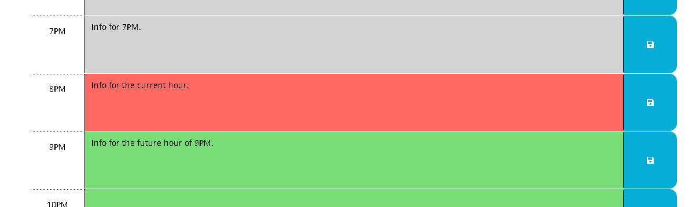

# nodejs-readme-generator

## Table of Contents

- [Description](#Description)
- [Deployment](#Deployment)
- [Usage](#Usage)
- [License](#License)
- [Questions?](#Questions?)

## Description

My very own simple Day Planner. Made using the criteria from Module 5 of my edX Web Development bootcamp.

## Deployment

[Here.](https://noahjralph.github.io/work-day-planner/)

## Usage

Each hour is labeled: Gray(past), Red(present), or Green(future).
On the deployed page, insert reminders or data into the text blocks next to each hour's time, then hit the save button. This will ensure the site will keep the inputed data.

## Demonstration

## License

This project is protected under the MIT License.

## Questions?

Reach out to me either on [GitHub](https://github.com/NoahJRalph) or by [Email](mailto:NoahJRalph@gmail.com)!
